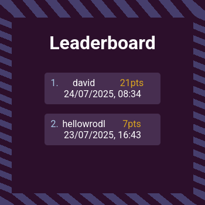

# SSS - Score Storage System
A simple and convenient API to save score from games.

# Features

- Simple API to interact with game to save score with username
- Support for GET and POST operations
- Error handling to ensure data accuracy

# Endpoints

|       Endpoint       |    Method    |         Description          |
|:--------------------:|:------------:|:----------------------------:|
| /score               |     GET      | Get all scores in descending-|
|                      |              | order                        |
| /score?page=x&limit=y|     GET      | Paginate score results       |
| /score               |     PUT      | Create score                 |

# Demonstration

Actual API being used by my [snake game](https://davideaded.github.io/snakegame/).

# Installation

1. Clone the repository: `https://github.com/davideaded/SSS---Score-Storage-System`
2. Navigate to the project directory: `cd SSS---Score-Storage-System`
3. Install the required dependencies: `npm install`
4. Set up database: `npx prisma db push`
5. Start the server: `npm run start`

# Usage

1. Set up .env (`DATABASE_URL=<db_connection_string>`)
2. Make HTTP requests to the API endpoints